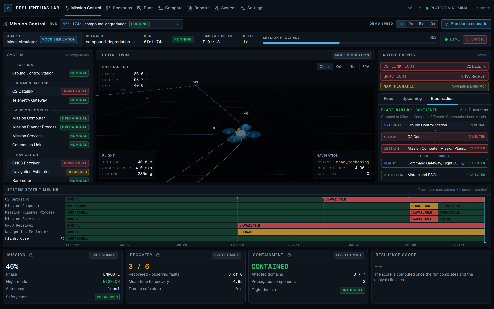
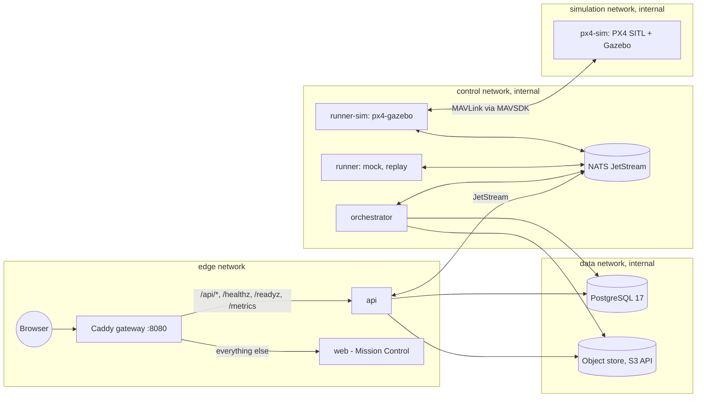

# Resilient UAS Lab

Open-source resilience engineering and chaos testing for autonomous systems.

> Inject failures. Measure degradation. Validate recovery.

Test autonomous-system resilience like software. Resilient UAS Lab injects the *effects*
of degradation into a simulated unmanned aircraft system, observes how the autonomy
detects, contains and recovers from them, and turns the observation into reproducible
metrics, a transparent score and a canonical report. Scenarios are declarative YAML,
targets are reached through a generic adapter contract, and every run can be replayed,
compared and gated in CI.

```text
GNSS degradation        ✓
Datalink loss           ✓
Sensor faults           ✓
Compute faults          ✓
Degraded modes          ✓
Recovery testing        ✓
Fault containment       ✓
Deterministic mock      ✓
SITL (PX4 + Gazebo)     ✓  validated against live PX4 SITL v1.18 + Gazebo Harmonic
Replay and compare      ✓
HITL                    Planned
ArduPilot, ROS 2        Planned
```

## Contents

1. [Product statement](#1-product-statement)
2. [Screenshot](#2-screenshot)
3. [Why this exists](#3-why-this-exists)
4. [Core capabilities](#4-core-capabilities)
5. [60-second quickstart](#5-60-second-quickstart)
6. [Demo scenario](#6-demo-scenario)
7. [Mission Control](#7-mission-control)
8. [Architecture](#8-architecture)
9. [Scenario format](#9-scenario-format)
10. [Metrics](#10-metrics)
11. [Resilience score](#11-resilience-score)
12. [Fault containment](#12-fault-containment)
13. [Docker](#13-docker)
14. [PX4 integration](#14-px4-integration)
15. [Security model](#15-security-model)
16. [Project scope and responsible-use statement](#16-project-scope-and-responsible-use-statement)
17. [Development](#17-development)
18. [CI/CD](#18-cicd)
19. [Roadmap](#19-roadmap)
20. [Contributing](#20-contributing)
21. [License](#21-license)
22. [References](#22-references)

## 1. Product statement

Resilient UAS Lab is a cyber-physical resilience testing platform for autonomous
systems operating in degraded, disconnected or partially failed environments. It
answers one question: how resilient is an autonomous architecture when components,
communications, navigation, compute resources or services progressively degrade?

The platform follows a single generic equation, independent of any flight stack:

```text
System + Scenario + Fault Profile + Recovery Policy + Telemetry = Resilience Report
```

Engineers define resilience scenarios, inject the effects of faults, execute scenarios
against an autonomous-system adapter, observe subsystem health in real time, measure
fault propagation and containment, evaluate safe-state transitions, collect telemetry,
compare runs, compute objective metrics, and generate machine-readable and
human-readable reports that regression-test resilience in CI/CD. PX4 with Gazebo is the
first real target; the architecture is not coupled to it.

## 2. Screenshot



*Mission Control at T+01:13 of the `compound-degradation` demo on the mock adapter:
three active injections, the blast radius stopped at the trust boundary, the flight core
untouched, mean time to recovery 4.9 s. Captured with the end-to-end browser tooling from
the Docker Compose stack, not composed by hand.*

## 3. Why this exists

Autonomous systems are usually tested for what they do when everything works. The
interesting engineering questions start when something does not: a navigation receiver
stops delivering fixes over a city, a command link degrades into packet loss, the
companion computer reboots mid-mission, or several of these happen within the same few
seconds. Does the flight core keep control? Does the estimator degrade gracefully or
lie? Does the mission planner come back, and how fast? Does damage stay on the side of
the trust boundary where it started?

Chaos engineering answered these questions for distributed software by injecting
failures deliberately and measuring the response. Resilient UAS Lab brings that
discipline to autonomous vehicles: a scenario language for declaring what degrades and
what is expected, an execution engine that drives a target through an adapter, a
measurement model with a shared vocabulary for states, recovery, containment and safety,
and tooling to make the results comparable across runs, versions and CI pipelines.

## 4. Core capabilities

| Area | In 0.1.0 |
| ---- | -------- |
| Scenario language | Versioned schema `resilient-uas.dev/v1alpha1`; strict validation; timeline events with bounded injections; expectations with deadlines; assertion grammar; abstract consequence profiles; canonical content hash for provenance |
| Fault catalogue | 11 abstract effects on 17 subsystems across 7 domains, with a per-effect parameter whitelist |
| Execution | Deterministic seeded engine; validated run state machine; cancellation at any stage; at-most-once job execution over NATS JetStream; progress-aware watchdog |
| Measurement | Availability, weighted navigation integrity, recovery records measured from the end of the disturbance window, topology-based propagation depth (blast radius), degraded-mode timing, safety preservation, mission continuity |
| Scoring | Seven weighted dimensions (weights sum to 100) with hard gates that override the score; default profile shipped, profile per scenario |
| Reports | `report.json` (schema 1.0) and a standalone `report.html`; every report states its data origin |
| Replay and comparison | Recording download; replay adapter reproduces identical metrics; baseline-versus-candidate comparison with a verdict |
| Adapters | Mock (deterministic, clearly labelled), PX4 SITL with modern Gazebo over MAVSDK (validated end to end on PX4 v1.18 + Gazebo Harmonic), replay; catalogue entries for planned adapters |
| Mission Control | Live mission view with digital twin, blast radius, state timeline, event feed and system panel; runs, run detail, compare, scenario library and studio, reports, system, settings; 1440x900 layout usable down to 1024 px |
| CLI | `reslab`: validate, run (platform or in-process), report, compare, system, regression check |
| API | Versioned REST API with OpenAPI, WebSocket run stream, Prometheus metrics, generated TypeScript client |
| Deployment | Multi-stage images (non-root, read-only, capabilities dropped, digest pinned); Compose stack with segmented internal networks; `sim` and `observability` profiles; no Docker socket anywhere |
| Assurance | Unit, integration and end-to-end suites; CI, security and simulation workflows; hardening policy checked in CI; SBOMs |

## 5. 60-second quickstart

Requirements: Docker Engine with Compose v2 (Linux, macOS or Windows with WSL 2), about
4 GB of free memory for the default stack, port 8080 free.

```bash
git clone <repository-url> resilient-uas-lab
cd resilient-uas-lab
cp .env.example .env
docker compose up --build -d
```

Wait until `docker compose ps` shows every service healthy (the first build takes a few
minutes), then open **http://localhost:8080**. Press **Run demo scenario**. If port 8080
is taken on your machine, set `RESLAB_GATEWAY_PORT` in `.env` before starting.

Without Docker, the scenario engine runs in-process with the mock adapter. This path and
the `reslab` command need [uv](https://docs.astral.sh/uv/getting-started/installation/)
(`brew install uv` on macOS):

```bash
uv sync --all-packages
uv run reslab run scenarios/compound-degradation.yaml --local --speed 50 -o artifacts/local
```

Both paths end with a resilience report. [`docs/getting-started.md`](docs/getting-started.md)
walks through them in detail.

## 6. Demo scenario

The demo scenario is `compound-degradation`: a 560 m waypoint mission on a multirotor
model during which three disturbances arrive in sequence.

| Time | Injection | Expected behaviour |
| ---- | --------- | ------------------ |
| T+30 s | `navigation.gnss` becomes `unavailable` for the rest of the mission | Estimator degrades to dead reckoning within 3 s; flight core stays operational |
| T+45 s | `communications.c2` becomes `unavailable` | Mission computer keeps operating on local autonomy |
| T+60 s | `mission.compute` restarts | Mission computer back within 10 s; flight core holds position meanwhile |

In Mission Control you watch the system panel change colour as each effect is
observed, the blast radius stop at the trust boundary between mission compute and
flight control, the state timeline grow, and the recovery counters update live. When the
mission completes, the orchestrator analyses the run: assertions are evaluated, metrics
computed, the score derived, and `report.json` and `report.html` are stored. The demo
passes with a resilience score of 92.2 on the mock adapter. The points it loses are on
navigation integrity (the estimator runs on dead reckoning for the rest of the flight)
and communications availability (the command link stays down), which is exactly what
the scenario asks the vehicle to survive; safety, recovery and containment score full
marks.

Queue a second run and open **Compare** to see the two side by side; on the
deterministic mock adapter with the same seed the verdict is `UNCHANGED`. Download the
recording of either run and replay it with the replay adapter to reproduce its metrics
exactly.

## 7. Mission Control

Mission Control is a Next.js application designed for a 1440x900 operations screen and
usable down to 1024 px. It is dark, dense and free of decoration: colour carries state
meaning everywhere (healthy, degraded, failed, informational, inactive), looked up from
one place so the vocabulary is consistent across pages.

- **Mission Control**: status bar (adapter with mock label, scenario, run, state,
  simulation time, speed, mission progress, live indicator, cancel), system panel with
  all 17 components grouped by domain, digital twin (chase, orbit, top and first-person
  cameras) with planned and flown paths, active events, feed, upcoming events and blast
  radius tabs, state timeline, and live estimates of mission, recovery and containment
  with the final score once analysis finishes.
- **Runs** and **run detail**: overview, metrics, assertions, events, telemetry
  charts, artifacts, replay and provenance.
- **Compare**: baseline versus candidate with verdict and per-metric deltas.
- **Scenarios** and **Scenario studio**: library, YAML document, effect library and
  editors, validation against the schema before saving.
- **Reports**, **System** (health, adapters, runners, topology) and **Settings**.

Nothing in the UI fabricates data. Values come from the API; anything that is an
estimate is labelled *live estimate* until the analysis replaces it.

## 8. Architecture



The **API** validates scenarios, creates runs and publishes jobs; it serves the REST API,
the WebSocket run stream and the OpenAPI document. **Runners** pull jobs from a JetStream
work queue (acknowledged on acceptance, so a job executes at most once), drive the
target through an adapter with the scenario engine, and publish lifecycle, events,
telemetry and artifacts. The **orchestrator** is the only writer of run progress: it
persists what runners publish, enforces the run state machine, watches for stale or
stuck runs, and performs the analysis that produces metrics, score and reports.
Runners never hold database or object store credentials.

Everything the target does is recorded as classified events: a *requested* injection is
distinct from an *applied* one, which is distinct from an *observed* state change, an
autonomous *system response* and a *recovery*. Metrics are computed from observations
only. [`docs/architecture.md`](docs/architecture.md) has the sequence diagram of a run,
the state machine, the bus subjects and the persistence model.

### Interfaces

The API is versioned under `/api/v1`; the OpenAPI document is served at `/api/docs`
and committed as `packages/schemas/openapi.json`, from which the TypeScript client in
`packages/client` is generated.

| Method and path | Purpose |
| --------------- | ------- |
| `GET /healthz`, `GET /readyz` | Liveness; readiness of database, bus and artifact store |
| `GET /api/v1/system` | Platform, health, adapters, runners, topology, fault catalogue |
| `GET/POST /api/v1/scenarios`, `POST /api/v1/scenarios/validate` | Library and validation |
| `GET/DELETE /api/v1/scenarios/{name}`, `GET .../document` | One scenario, its raw YAML |
| `GET/POST /api/v1/runs`, `GET /api/v1/runs/{id}`, `POST .../cancel` | Runs |
| `GET /api/v1/runs/{id}/events`, `.../telemetry`, `.../metrics` | Recorded data and analysis |
| `GET /api/v1/runs/{id}/report`, `.../report.html`, `.../artifacts`, `.../artifacts/{name}` | Reports and artifacts |
| `GET /api/v1/runs/{id}/recording` | Replay recording |
| `WS /api/v1/runs/{id}/stream` | Snapshot, then lifecycle, event, telemetry and completion messages with heartbeats |
| `GET /api/v1/compare` | Baseline versus candidate |
| `GET /metrics` | Prometheus metrics |

Request bodies are size limited, identifiers are validated before they reach storage,
and errors use one `ApiError` shape.

```bash
uv run reslab --version
uv run reslab scenario validate scenarios/gnss-loss.yaml
uv run reslab run scenarios/gnss-loss.yaml --local --speed 50 -o artifacts/local
uv run reslab run compound-degradation --api http://localhost:8080          # queue on the platform and follow
uv run reslab report <run-id> --api http://localhost:8080 -o report.json --html report.html
uv run reslab compare <baseline-run-id> <candidate-run-id> --api http://localhost:8080
uv run reslab system --api http://localhost:8080
uv run reslab regression check --candidate artifacts/reports --thresholds regression-thresholds.yaml
```

`reslab run` exits non-zero when the benchmark is not passed, so it can gate a pipeline
directly. The API base URL can also be given with `RESLAB_API_URL`.

### Adapters

An adapter implements one contract (`packages/core/reslab_core/adapter.py`): prepare,
start, inject, clear, observe, health, snapshot, stop, collect artifacts, and a
truthful declaration of capabilities. The control plane knows nothing about PX4 or ROS 2.

| Adapter | Status | Notes |
| ------- | ------ | ----- |
| `mock` | available | Deterministic component-state simulation of a multirotor with companion computer; supports the whole catalogue; every output labelled as mock |
| `px4-gazebo` | experimental | PX4 SITL with modern Gazebo (Harmonic) headless in the `sim` profile, over MAVLink through MAVSDK; injects observable effects by removing EKF aiding sources (GNSS, baro, mag) and by dropping the MAVLink link to trigger PX4's real data-link-loss failsafe; validated end to end (see below) |
| `replay` | available | Re-emits a recorded run |
| `px4-hitl`, `ardupilot`, `ros2` | planned | Catalogue entries only; no code in this release |

The PX4 adapter's unit tests run against a fake link. It has **not** been executed
against a live PX4 SITL in the environment where this release was built; its status,
what is known to work from the code and what remains to be confirmed are recorded in
[`docs/px4-integration.md`](docs/px4-integration.md). Writing an adapter is described
in [`docs/adapter-development.md`](docs/adapter-development.md).

### Deviations from the original plan

Three choices differ from the plan the project started with, each for a stated reason.
The artifact store is [RustFS](https://github.com/rustfs/rustfs) rather than MinIO:
the MinIO community edition stopped receiving releases in 2026, and the platform only
speaks the S3 API, so any S3-compatible endpoint works (`docs/deployment.md`).
TimescaleDB is not used: telemetry is persisted as JSONB chunks of samples per run in
plain PostgreSQL, which keeps the deployment to one stock image and is sufficient for
the telemetry rates of 0.1.0; a time-series extension remains an option behind the same
repository interface. The `packages/` directory holds three Python packages (`core`,
`platform`, `cli`) in addition to `schemas` and `client`, so that the domain library has
no I/O dependencies and can be imported by the CLI and by adapters without pulling in
the database or the bus.

## 9. Scenario format

A scenario is one YAML document:

```yaml
apiVersion: resilient-uas.dev/v1alpha1
kind: ResilienceScenario
metadata:
  name: gnss-loss
  description: Complete loss of GNSS aiding while enroute.
  version: "1"
  tags: [navigation]
target:
  adapter: mock
  vehicle: x500
mission:
  type: waypoint
  timeout: 180s
recovery:
  gnss_loss: dead_reckoning
  max_dead_reckoning: 120s
simulation:
  seed: 7
events:
  - id: gnss-loss
    at: 35s
    duration: 40s
    inject:
      subsystem: navigation.gnss
      effect: unavailable
    expect:
      - subsystem: navigation.estimator
        state: DEGRADED
        within: 3s
      - subsystem: flight_control.core
        state: OPERATIONAL
        within: 1s
assertions:
  - expression: flight_control.available == true
    severity: critical
  - expression: recovery.navigation_estimator < 5s
    severity: high
  - expression: mission.completed == true
    severity: medium
```

Events inject one effect on one subsystem at a point in the mission timeline, optionally
bounded by a `duration`. Expectations declare what must be observed and by when.
Assertions are evaluated after the run against the metrics context using a small
grammar (`path op literal` with booleans, numbers, durations and percentages). A
`profile` block declares a consequence profile that expands into simultaneous events.

The library ships seven starter scenarios:

| Scenario | Tests |
| -------- | ----- |
| `compound-degradation` | Sequential navigation, communications and compute degradation; containment and mission completion (the demo) |
| `gnss-loss` | Graceful degradation to dead reckoning and recovery when GNSS returns |
| `datalink-loss` | Latency, then packet loss, then loss of the command link; local autonomy takes over |
| `sensor-failure` | Erroneous barometer and stuck magnetometer; estimator rejects faulty sensors |
| `mission-compute-restart` | Companion computer restart while enroute; autonomous hold and planner recovery |
| `resource-pressure` | Sustained CPU and memory pressure and a services outage; planning slows but continues |
| `em-transient-profile-a` | Abstract electromagnetic consequence profile: simultaneous intermittent GNSS, compute restart and telemetry outage; flight control untouched |

Validate with `reslab scenario validate <file>`; the schema is published in
`packages/schemas/scenario.v1alpha1.schema.json`. Field-by-field reference:
[`docs/scenario-format.md`](docs/scenario-format.md).

### Fault catalogue

Effects are abstract consequences. Each is allowed only on the subsystems where it
makes sense and accepts only whitelisted parameters with bounded values.

| Effect | Meaning | Parameters |
| ------ | ------- | ---------- |
| `unavailable` | The component provides no function | none |
| `intermittent` | Function comes and goes | `period`, `duty_cycle` |
| `degraded` | Reduced quality or capacity | `level` |
| `erroneous` | Output is wrong but present | none |
| `stuck` | Output freezes at its last value | none |
| `restart` | The component restarts (transient) | `restart_time` |
| `crash` | The component crashes and is restarted by a watchdog (transient) | `watchdog_time` |
| `latency` | Added delay on a link | `latency_ms` |
| `packet_loss` | Fraction of messages lost on a link | `loss_ratio` |
| `resource_pressure` | CPU and memory pressure on a compute node | `load` |
| `temporary_disconnect` | A link disconnects and reconnects | none |

Adapters declare which effects they can realise on which subsystems; a scenario that
asks for an unsupported pair is rejected before the run starts, and an injection an
adapter cannot apply at run time is recorded as `INJECTION_REJECTED`, never silently
skipped.

### The resilience model behind the vocabulary

The platform describes a vehicle as a **topology** of 17 components in 7 domains
(external, communications, mission compute, navigation, flight control, actuation,
power) with declared dependencies, two **trust boundaries** (external to mission
compute at the telemetry gateway, mission compute to flight control at the security
gateway) and three **critical components** (IMU, flight core, motors).

Every component is always in one of eight **states**: `NOMINAL`, `OPERATIONAL`,
`DEGRADED`, `UNAVAILABLE`, `FAILED`, `RECOVERING`, `RECOVERED`, `UNKNOWN`. The first
two and `RECOVERED` count as healthy. A **run** moves through `CREATED`, `VALIDATING`,
`QUEUED`, `PREPARING`, `RUNNING` (alternating with `RECOVERING`), `COLLECTING`,
`ANALYZING` and ends `COMPLETED`, `FAILED` or `CANCELLED`; invalid transitions are
rejected in code.

Three ideas carry the measurement:

- **Disturbance window and recovery.** A fault's duration is the window during which
  an injection (or an injection on an upstream provider) is active. Recovery time is
  measured from the *end* of that window to the return to a healthy state, so a
  40 second outage followed by a 0.1 second recovery reads as exactly that.
- **Containment.** Propagation depth is computed by breadth-first search over the
  topology from each injected component. A run is *contained* when nothing observed
  crosses into the flight control or actuation domains without having been injected
  there.
- **Safety.** Control authority, flight core availability and the reachable safe states
  (hold, return to launch, land) are tracked continuously; loss of control fails the run
  regardless of its score.

[`docs/resilience-model.md`](docs/resilience-model.md),
[`docs/degraded-modes.md`](docs/degraded-modes.md) and
[`docs/safety-model.md`](docs/safety-model.md) define every term.

## 10. Metrics

Metrics are computed by the orchestrator from the recorded telemetry and events:
availability per component (components never observed are excluded, not counted as
healthy), weighted navigation integrity, a recovery record per disturbed component
(fault duration, recovery time, outcome), propagation depth and affected domains,
time spent in each degraded mode, safety indicators and mission continuity.

Every completed run produces `report.json` (schema version `1.0`, published in
`packages/schemas/report.v1.0.schema.json`) and `report.html`, a self-contained document
with inline styles and no scripts, served with a Content Security Policy that forbids
script execution. Both carry provenance: software version, git commit, scenario content
hash, adapter and adapter version, seed, speed, and the **data origin** (the mock
adapter reports `mock simulation (no flight stack, no hardware)`, and the UI labels such
runs as mock).

`GET /api/v1/runs/{id}/recording` downloads the normalised telemetry and events. The
replay adapter re-emits a recording as if it were live, so a run can be re-analysed,
demonstrated without a simulator, or used as a fixture; replaying a run reproduces its
metrics. `GET /api/v1/compare?baseline=<id>&candidate=<id>` (and the Compare page)
report metric deltas, assertion changes and a verdict: `unchanged`, `improvement`,
`regression`, `mixed`, or `not_comparable` when the runs differ in scenario or adapter.

## 11. Resilience score

The score aggregates seven dimensions with weights that must sum to 100. The default
profile is safety 30, mission continuity 20, recovery 20, containment 15, navigation
10, communications 5, compute 0. Three **hard gates** override the score: every
critical assertion must pass, control authority must never be lost, and the run must
complete. A run that fails a gate is `failed` whatever its numeric score; a run that did
not finish is `inconclusive`. The report shows each dimension, its weight, its value and
the reason for the final result, so a number can always be traced back to observations.
[`docs/metrics.md`](docs/metrics.md) and [`docs/scoring.md`](docs/scoring.md) give the
formulas.

## 12. Fault containment

Fault containment is the signature measurement. Every injected component is a root
of a breadth-first search over the topology's dependency graph; the components whose
observed state changed downstream of a root form the blast radius, and the two trust
boundaries (external to mission compute at the telemetry gateway, mission compute to
flight control at the security gateway) decide whether the propagation stayed where it
started. The result is reported as:

```text
affected_domains            domains with at least one affected component
affected_components         components whose observed state left healthy
max_propagation_depth       longest dependency path from an injection to an affected component
critical_domain_reached     a critical component (IMU, flight core, motors) was affected
flight_domain_affected      anything in flight_control or actuation was affected
```

Mission Control's **Blast radius** tab draws the topology as a column of domains from
least to most trusted, marks injected and affected components, draws the trust boundary
and states `BLAST RADIUS: CONTAINED` with the count of affected domains when nothing
crossed. In the demo the three injections touch communications, mission compute and
navigation, the navigation estimator degrades with its receiver, and the flight domain is
reported `UNTOUCHED`. The assertion `containment.flight_domain_affected == false` turns
that observation into a critical hard gate. Definitions:
[`docs/trust-boundaries.md`](docs/trust-boundaries.md),
[`docs/metrics.md`](docs/metrics.md).

## 13. Docker

`compose.yaml` is the reference deployment: gateway, web, api, orchestrator, runner,
migrate, nats, postgres and objectstore, plus the `sim` profile (`px4-sim`,
`runner-sim`) and the `observability` profile (`prometheus`, `nats-exporter`,
`grafana`). All images are pinned by digest. Project images run as an unprivileged
user with a read-only root filesystem, all capabilities dropped and
`no-new-privileges`; every network except the browser-facing edge is internal; the only
published port is the gateway (and Grafana in its profile); no container mounts the
Docker socket and none is privileged. These rules are written down in
[`security/policies/container-hardening.md`](security/policies/container-hardening.md)
and enforced by `make policy` and the `Security` workflow.

The default credentials in `.env.example` are for local use. `security/examples/`
shows how to terminate TLS at the gateway, authenticate the event bus with per-service
permissions and require SCRAM for PostgreSQL. [`docs/deployment.md`](docs/deployment.md),
[`docs/security-model.md`](docs/security-model.md) and
[`docs/trust-boundaries.md`](docs/trust-boundaries.md) cover the rest.

### Observability profile

`docker compose --profile observability up -d` adds Prometheus (scraping the API,
orchestrator, runner and a NATS exporter), and Grafana on port 3001 with a provisioned
datasource and a platform dashboard (active runs, runs finalized, runner activity,
API request rate and latency, bus messages processed by type). Services log structured JSON with the run identifier on
every line; the platform emits Prometheus metrics for runs, jobs and analysis.

## 14. PX4 integration

The `sim` profile adds two services: `px4-sim`, the official PX4 SITL image with modern
Gazebo (Harmonic) pinned by digest and running headless, and `runner-sim`, a runner that
advertises only the `px4-gazebo` adapter and is the only service attached to the
`simulation` network besides the simulator. Mission Control never renders Gazebo; the
digital twin is fed from normalised telemetry, so the web application works identically
whether the target is the mock or the simulator.

The adapter speaks MAVLink to PX4 through MAVSDK. It uploads the scenario mission, arms
and starts it, derives component states from PX4 health, mode and link telemetry, and
maps scenario effects to PX4's simulation failure injection (`SYS_FAILURE_EN=1` is set
during preparation) and to mission commands. Effects that PX4 cannot realise are
declared unsupported in the adapter's capabilities so that a scenario asking for them is
rejected before the run starts. When the simulator is unreachable the run fails within
the connection timeout with an explicit reason, and the orchestrator has a backstop
timeout of its own; the rest of the platform is unaffected.

```bash
docker compose --profile sim up --build -d
uv run reslab run gnss-loss --adapter px4-gazebo --api http://localhost:8080
```

Linux is the reference simulation environment. The adapter was executed against a live
PX4 SITL (PX4 v1.18.0-rc1, Gazebo Harmonic, MAVSDK 3.17.4), both directly through the
engine and through the full Compose `sim` stack. Three scenarios pass end to end with
real injected faults: `gnss-loss` (97.4), `mission-compute-restart` (82.2) and
`compound-degradation` (74.2); their reports are in
[`docs/px4-runs/`](docs/px4-runs/). One measured finding shaped the adapter: PX4's
`MAV_CMD_INJECT_FAILURE` sensor injections are accepted but not realised by this Gazebo
image, so GNSS, barometer and magnetometer losses are injected by removing the aiding
source from the EKF, and command and companion-link losses by dropping the MAVLink link
to trigger PX4's real data-link-loss failsafe. What was observed, what stays UNKNOWN and
the remaining limitations are in [`docs/px4-integration.md`](docs/px4-integration.md).
The nightly `Simulation (PX4 SITL)` workflow reproduces a run and fails clearly if PX4
does not start, if no fault is applied, or if the benchmark does not pass; it is not a
required check because a run needs the multi-gigabyte image and minutes of flight.

## 15. Security model

The platform is designed so that a hostile scenario file, a compromised runner or an
untrusted artifact cannot reach beyond its intended blast radius:

- **Scenarios are data.** Restricted YAML loader, strict schema with unknown keys
  rejected, closed fault catalogue with per-effect parameter whitelists, size limits,
  constrained identifiers, no code execution path of any kind.
- **Runners are untrusted workers.** They receive jobs over the event bus and hold no
  database or object store credentials; the orchestrator is the only writer of run
  progress and treats runner messages as claims to be recorded, not commands.
- **The API validates everything it stores.** Body size limits, identifier validation,
  path traversal prevention on artifact names, one error shape, no stack traces in
  responses.
- **Reports are inert.** Stored HTML is served with a Content Security Policy that
  forbids scripts.
- **Containers are hardened by default** (section 13) and the rules are enforced by
  `make policy` in CI.
- **Networks are segmented**: `edge` (browser-facing), `control` (event bus), `data`
  (persistence), `simulation` (runner and simulator only), `observability`; everything
  except `edge` is internal.
- **Trust boundaries in the vehicle model** are visualised and measured today and are
  written to align with ROS 2 security enclaves later; `security/examples/sros2/`
  holds an example SROS2 policy for the planned ROS 2 adapter.

Authentication is not required for the local experience and is designed to be added at
the gateway or the API as OIDC (Keycloak, Microsoft Entra ID or any enterprise
provider) without changing the service contracts. Details, controls and known
limitations: [`docs/security-model.md`](docs/security-model.md),
[`docs/threat-model.md`](docs/threat-model.md),
[`docs/trust-boundaries.md`](docs/trust-boundaries.md),
[`security/README.md`](security/README.md), [`SECURITY.md`](SECURITY.md).

## 16. Project scope and responsible-use statement

The platform models **consequences**, never **causes**. A scenario says "the GNSS
receiver is unavailable from T+30 s", "the datalink drops 40 % of packets", "the mission
computer restarts", "these three subsystems degrade together for eight seconds". It
never says how such a thing would be brought about, and it has no place to say it: the
schema has no field for a source, a signal, a power level, a frequency, an antenna, a
distance or any physical parameter of a disturbance.

Specifically, the project does not implement, document or accept contributions for:
RF jamming or interference of any kind, GNSS or sensor spoofing signal generation,
electromagnetic effect generation, weapon or effector parameters, targeting, offensive
exploitation, destructive payloads, or interfaces to real aircraft, radios and
receivers. The abstract electromagnetic scenario shipped with the platform is a
*consequence profile*: which subsystems degrade, in what way, for how long. See
[`docs/threat-model.md`](docs/threat-model.md) for the scope line and
[`docs/em-resilience.md`](docs/em-resilience.md) for what the profile can and cannot
express.

Scenarios are data. They are parsed with a restricted YAML loader, validated against a
strict schema and a closed fault catalogue, and never evaluated as code. There is no
`eval`, no shell, no dynamic loading anywhere in the scenario path.

## 17. Development

```bash
make setup            # uv sync --all-packages && pnpm install
make lint             # ruff, eslint, prettier
make typecheck        # tsc for the client and the web application
make test             # pytest (Python packages) and vitest (web)
make test-integration # mock pipeline through NATS, PostgreSQL and the object store
make e2e              # Playwright journey against the running stack
make gen-client       # export schemas and OpenAPI, regenerate the TypeScript client
make policy           # container hardening policy
```

The Python side is a `uv` workspace (Python 3.12, Pydantic v2, SQLAlchemy 2, Alembic,
FastAPI, nats-py, boto3); the web side is a `pnpm` workspace (Next.js, React, TypeScript
strict, Tailwind, TanStack Query, Zustand, React Three Fiber, Recharts). Every target
above is what CI runs. [`docs/development.md`](docs/development.md) explains how to run
the services locally against Compose-managed infrastructure.

```
apps/web                Mission Control (Next.js)
services/api            REST API, WebSocket stream, OpenAPI
services/orchestrator   Run state, watchdog, analysis, reports
services/runner         Job execution with adapters
packages/core           Domain model, schema, engine, metrics, scoring, reports
packages/platform       Settings, database, migrations, bus, artifact store
packages/cli            The reslab command line interface
packages/schemas        Published JSON Schemas and OpenAPI (generated, committed)
packages/client         Generated TypeScript API client
adapters/mock, px4-gazebo, replay
scenarios/              Starter scenario library
security/               Policies, policy checker, hardening examples
infra/                  Dockerfiles, gateway, NATS and observability configuration
tests/integration, tests/e2e
docs/                   Documentation
.github/workflows       ci.yml, security.yml, simulation.yml
```

### Verification status of this release

What was executed for `v0.1.0`, and what was not:

| Check | Result |
| ----- | ------ |
| Python unit tests (`uv run pytest`) | 138 passed, 6 integration tests skipped without infrastructure |
| Web unit tests (`vitest`) | 49 passed |
| Lint, format, type checks | clean (ruff, eslint, prettier, tsc) |
| Schema and client drift | none (`scripts/export_schemas.py --check`, generated client committed) |
| Integration suite (API, orchestrator, runner, NATS, PostgreSQL, RustFS) | 6 passed |
| Compose stack `docker compose up --build` | all 9 default services healthy; hardening verified on the running containers |
| End-to-end (Playwright against the gateway) | 5 passed: load, live demo run to report, compare, scenario studio, remaining pages |
| Observability profile | Prometheus scraping all four targets, Grafana dashboard provisioned |
| `sim` profile (PX4 SITL) | Executed against live PX4 v1.18 + Gazebo Harmonic, both directly and through the full Compose stack: `gnss-loss`, `mission-compute-restart` and `compound-degradation` pass end to end with real injected faults ([`docs/px4-runs/`](docs/px4-runs/)) |
| Container scans | Dockerfile misconfiguration scan clean; no fixable high or critical vulnerabilities in the project images at build time |

The in-process and platform runs of all seven starter scenarios pass on the mock
adapter. Mock results are results about the mock's model of a vehicle, and are labelled
as such everywhere they appear.

## 18. CI/CD

Three GitHub Actions workflows live in `.github/workflows`, with every action pinned to
a commit:

- **`ci.yml`** on pushes, tags and pull requests: Ruff lint and format, Python unit
  tests, schema and generated client drift, scenario validation, every starter scenario
  executed in-process with the regression check, Prettier, ESLint, TypeScript type
  check, web unit tests and production build, container image builds with a non-root
  check, the mock pipeline integration suite against PostgreSQL, NATS JetStream and an
  S3 store, and the Playwright journey against the full Compose stack. Reports and
  Playwright traces are uploaded as workflow artifacts.
- **`security.yml`** on pushes, pull requests and weekly: dependency review, `pip-audit`
  and Bandit, `pnpm audit`, secret scanning with gitleaks, CodeQL for Python and
  TypeScript, the container hardening policy, Trivy Dockerfile and image scans with
  SARIF upload, and SPDX SBOMs for the images.
- **`simulation.yml`** nightly and on demand: the PX4 SITL profile with a chosen
  scenario, report and logs uploaded.

Resilience can regress like any other property. The CI workflow of this repository
executes every starter scenario in-process on the mock adapter and runs
`reslab regression check` against `regression-thresholds.yaml`, which sets, per scenario,
the minimum score, the maximum mean time to recovery and the assertions that must keep
passing. Point `--baseline` at a directory of reports from a previous version to also
fail on score drops between versions. The same command works against any directory of
`report.json` files, including reports downloaded from a platform.

## 19. Roadmap

The roadmap ([`docs/roadmap.md`](docs/roadmap.md)) is explicit about what exists, what
is planned without code, and what is not planned. Near-term items: confirm the PX4
adapter against live SITL and promote the simulation workflow, the ArduPilot and ROS 2
adapters, score profile management, and authentication and TLS as defaults of the
reference stack.

| Version | Theme | Contents |
| ------- | ----- | -------- |
| v0.1 (this release) | Foundation | Mission Control, scenario engine, mock adapter, PX4 SITL adapter (experimental), metrics and score, reports, fault containment, Compose, CI |
| v0.2 | Security and replay | SROS2 policy integration, richer replay, ULog and rosbag ingestion, deeper trust-boundary analysis, score profile management |
| v0.3 | Hardware integration | PX4 HITL, physical runner architecture, bench profiles (no automatic hardware control without an explicit safety design) |
| v0.4 | Multi-system | ArduPilot adapter, generic ROS 2 adapter, adapter SDK |
| v0.5 | Distributed experimentation | Distributed runners, Kubernetes execution as a job per scenario, campaigns and repeated statistical runs |

Roadmap items are intentions, not promises.

## 20. Contributing

Contributions are welcome within the scope described above; the process, conventions
and release rules are in [`CONTRIBUTING.md`](CONTRIBUTING.md). Vulnerabilities are
reported privately through GitHub's security advisories as described in
[`SECURITY.md`](SECURITY.md). Participation is governed by the
[Code of Conduct](CODE_OF_CONDUCT.md).

Documentation index: [`docs/README.md`](docs/README.md). Notable changes:
[`CHANGELOG.md`](CHANGELOG.md).

## 21. License

Resilient UAS Lab is released under the [Apache License 2.0](LICENSE). To cite it, use
the metadata in [`CITATION.cff`](CITATION.cff).

## 22. References

Upstream documentation used by this project:

- PX4 Autopilot user guide: https://docs.px4.io/main/en/ ; Gazebo simulation:
  https://docs.px4.io/main/en/sim_gazebo_gz/ ; failure injection in simulation:
  https://docs.px4.io/main/en/debug/failure_injection.html ; PX4 containers:
  https://docs.px4.io/main/en/test_and_ci/docker.html
- MAVSDK: https://mavsdk.mavlink.io/
- Gazebo: https://gazebosim.org/docs
- ROS 2 documentation: https://docs.ros.org/en/rolling/ ; ROS 2 security (SROS2):
  https://docs.ros.org/en/jazzy/Tutorials/Advanced/Security/Security-Main.html
- Docker Engine security: https://docs.docker.com/engine/security/ ; Docker Compose:
  https://docs.docker.com/compose/
- NATS JetStream: https://docs.nats.io/nats-concepts/jetstream
- uv: https://docs.astral.sh/uv/ ; Next.js: https://nextjs.org/docs
- Conventional Commits: https://www.conventionalcommits.org/en/v1.0.0/ ; Keep a
  Changelog: https://keepachangelog.com/en/1.1.0/
