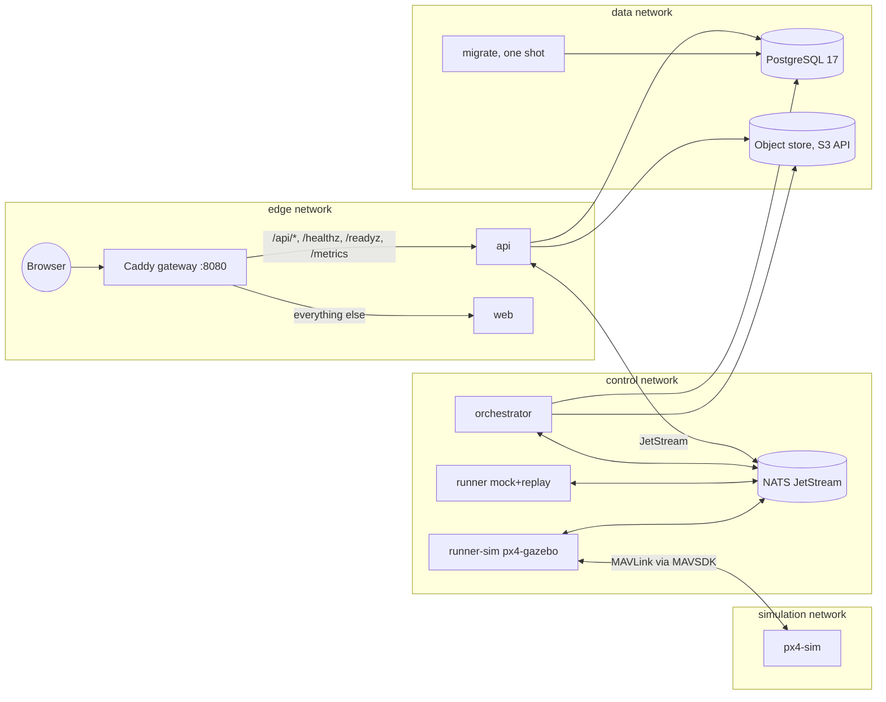
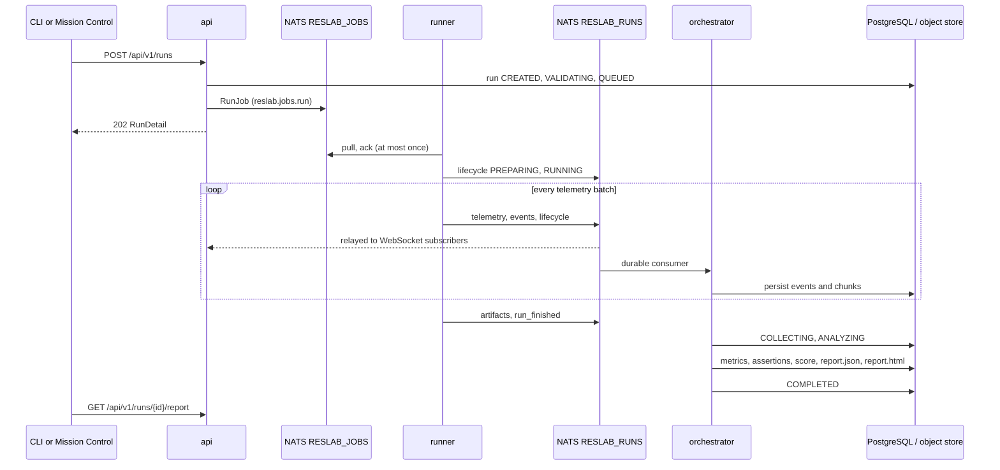
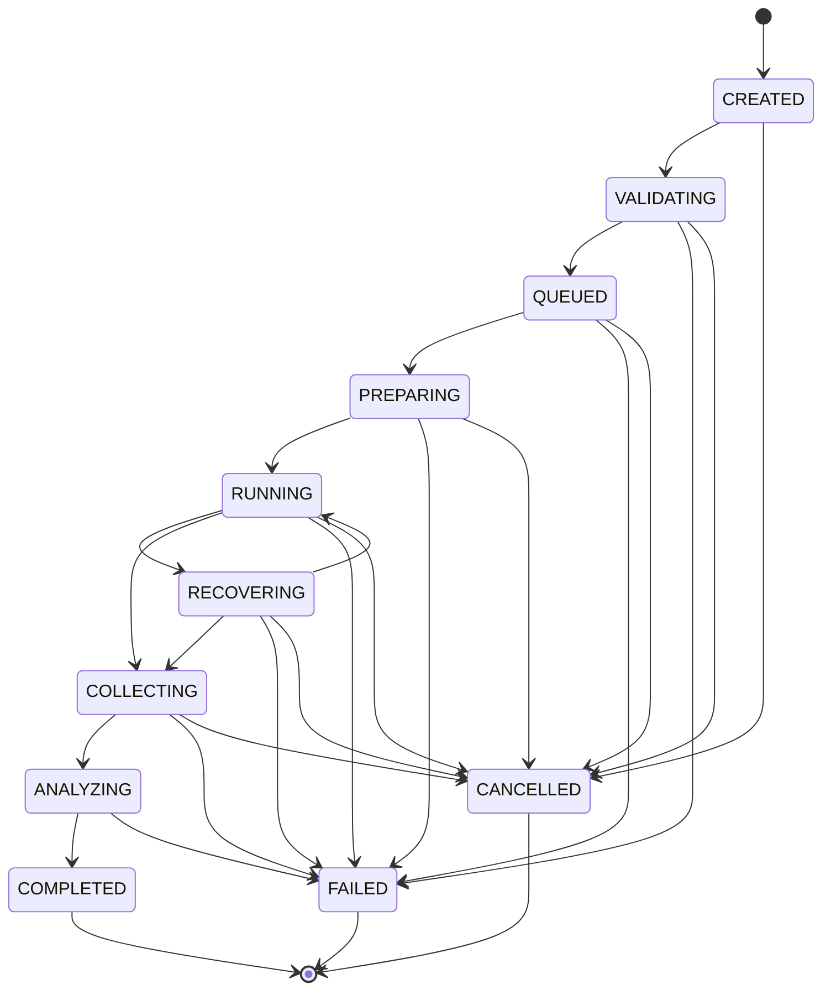

# Architecture

Resilient UAS Lab is a platform for measuring how an autonomous system behaves when
parts of it degrade. A user writes a declarative scenario (which subsystem experiences
which effect, when, for how long, and what behavior is expected), the platform executes
that scenario against a target through an adapter, records everything the target does,
and produces objective metrics, a transparent score and a canonical report.

This document describes the pieces and how they fit together. The other documents go
deeper: [scenario format](scenario-format.md), [metrics](metrics.md),
[scoring](scoring.md), [adapter development](adapter-development.md),
[security model](security-model.md), [deployment](deployment.md).

## Design principles

The code base follows a small number of rules that explain most of its shape.

1. **Effects, not causes.** The platform simulates the consequences of degradation
   (a sensor goes silent, a link drops packets, a process restarts). It never models
   how a disturbance is produced. The [threat model](threat-model.md) draws the line.
2. **Scenarios are data.** A scenario is a YAML document validated against a closed
   schema and a closed fault catalog. It cannot express commands, code, file paths or
   module names, and it is never evaluated as code.
3. **Requested is not observed.** Every run event is classified so that a requested
   injection, a confirmed injection, an observed state change, an autonomous response
   and a recovery are distinct records. Metrics are computed only from observations.
4. **The control plane does not know the target.** Services speak to targets only
   through the generic adapter contract. PX4, ArduPilot or ROS 2 specifics live in
   adapters.
5. **Runners are untrusted workers.** They receive jobs over the event bus and hold no
   database or object store credentials.
6. **Everything is versioned independently.** Software `0.2.0`, scenario schema
   `resilient-uas.dev/v1alpha1`, report schema `1.0`, runner protocol `1`
   (`packages/core/reslab_core/versions.py`).

## Repository layout

| Path | Contents |
| ---- | -------- |
| `packages/core` | `reslab_core`: pure domain library with no I/O dependencies. States, topology, scenario schema and loader, fault catalog, scenario engine, adapter contract, metrics, scoring, report model and HTML renderer, runner protocol messages |
| `packages/platform` | `reslab_platform`: settings, structured logging, database models and Alembic migrations, repository functions, NATS JetStream bus client, artifact store |
| `packages/cli` | `reslab_cli`: the `reslab` command line interface, including in-process execution and the regression check |
| `packages/schemas` | Published JSON Schemas and the OpenAPI document, generated from the models and checked in CI |
| `packages/client` | Generated TypeScript client (`openapi-typescript` + `openapi-fetch`) used by the web application |
| `adapters/mock`, `adapters/px4-gazebo`, `adapters/replay` | Target adapters |
| `services/api`, `services/orchestrator`, `services/runner` | The three long-running services |
| `apps/web` | Mission Control, a Next.js application |
| `scenarios/` | The seven starter scenarios |
| `infra/` | Dockerfiles, Caddy gateway, NATS configuration, Prometheus and Grafana provisioning |
| `tests/integration`, `tests/e2e` | Cross-service tests; unit tests live next to each package |

`reslab_core` is deliberately free of database, bus and HTTP dependencies so that every
other package, including the adapters and the CLI, can depend on it without pulling in
the platform.

## Runtime components

The Compose stack (`compose.yaml`) publishes a single port, the gateway on 8080. The
`control`, `data`, `simulation` and `observability` networks are internal. Runners are
on `control` (and on `observability` for metrics scraping) but never on `data`: they
cannot reach PostgreSQL or the object store. The `sim` profile
adds `px4-sim` and `runner-sim`; the `observability` profile adds Prometheus, a NATS
exporter and Grafana (Grafana publishes a second port). See [deployment](deployment.md).

### API (`services/api`)

A FastAPI application that owns the versioned REST API under `/api/v1`, the WebSocket
run stream, the OpenAPI documents (`/api/docs`, `/api/redoc`, `/api/openapi.json`),
health probes (`/healthz`, `/readyz`) and Prometheus metrics (`/metrics`).

The API creates runs: it validates the scenario document, records the run as
`CREATED -> VALIDATING -> QUEUED`, and publishes a `RunJob` on the work queue. It also
subscribes to `reslab.runs.>` on the bus and fans messages out to WebSocket clients
through an in-process hub (`reslab_api/state.py`). It reads run data from PostgreSQL
and report artifacts from the object store. It never writes run progress; that is the
orchestrator's job.

Middleware: a body size limit (413 above `RESLAB_API_MAX_BODY_BYTES`, default 512 KiB),
CORS restricted to configured origins and to `GET`, `POST`, `DELETE`, `OPTIONS`, a
request id header, `X-Content-Type-Options: nosniff` and `Referrer-Policy: no-referrer`
on every response. Stored HTML reports are served with a Content Security Policy that
forbids scripts.

### Orchestrator (`services/orchestrator`)

The only writer of run progress. It consumes the `RESLAB_RUNS` stream through a durable
pull consumer, validates every lifecycle transition against the run state machine,
persists events, telemetry chunks and artifacts, and finalizes runs. When a runner
reports completion the orchestrator moves the run to `ANALYZING`, computes metrics,
evaluates assertions, scores the run, renders `report.json` and `report.html`, stores
them and marks the run `COMPLETED`. A failed or cancelled run still gets a best-effort
report (result `inconclusive`).

A watchdog (`RESLAB_ORCHESTRATOR_WATCHDOG_SECONDS`, default 10) fails runs that stayed
`QUEUED` longer than `RESLAB_QUEUED_TIMEOUT_SECONDS` (default 300) and runs whose
runner stopped heartbeating or making progress for `RESLAB_RUNNER_STALE_AFTER_SECONDS`
(default 45). A run that keeps producing messages is considered alive whatever the
heartbeat says.

### Runner (`services/runner`)

Pulls jobs from the `RESLAB_JOBS` work queue, constructs the requested adapter, drives
it with the scenario engine and publishes everything the engine emits to
`reslab.runs.<run_id>.*`. Acceptance is at most once: the job is acknowledged as soon
as a runner accepts it. If a runner dies mid-run the orchestrator's watchdog fails the
run, which is preferable to silently re-running a scenario that may already have
produced telemetry. A runner that does not offer the requested adapter hands the job
back (`nak` with a five second delay) so that another runner can take it.

Each runner advertises its adapters in a heartbeat every
`RESLAB_RUNNER_HEARTBEAT_SECONDS` (default 10). The default runner offers `mock,replay`;
`runner-sim` in the `sim` profile offers `px4-gazebo`. Concurrency per runner is
`RESLAB_RUNNER_CONCURRENCY` (default 1, at most 8).

### Scenario engine (`reslab_core.engine`)

The engine runs inside the runner (and inside the CLI for `reslab run --local`). It
schedules scenario events on the simulation clock reported by the adapter, requests
injections and records whether the adapter applied them, clears bounded injections
when their duration elapses, classifies every observed change, verifies declared
expectations, batches telemetry (0.5 s of simulation time or 200 samples per batch),
and enforces the mission timeout and cancellation. It does not know what the target
is; it only speaks the adapter contract. Its semantics are described in
[resilience model](resilience-model.md) and [scenario format](scenario-format.md).

### Adapters

An adapter implements `reslab_core.adapter.AutonomousSystemAdapter`: `prepare`,
`start`, `inject`, `clear`, `observe`, `health`, `snapshot`, `stop`,
`collect_artifacts`, plus a `capabilities` descriptor that states which effects it can
realize on which subsystem and where its data comes from (`data_origin`). Three
adapters ship with this release:

| Adapter | Status | Data origin | Notes |
| ------- | ------ | ----------- | ----- |
| `mock` | available | `mock simulation (no flight stack, no hardware)` | Deterministic component-state model; supports the whole fault catalog |
| `px4-gazebo` | experimental | `PX4 SITL simulation (software in the loop, no hardware)` | MAVSDK transport, PX4 failure injection; see [PX4 integration](px4-integration.md) |
| `replay` | available | `replay of a recorded run (no live target)` | Re-emits the normalized telemetry and events of a completed run |

The adapter catalog (`reslab_core/adapters_catalog.py`) also lists `px4-hitl`,
`ardupilot` and `ros2` with status `planned`; none of them has code in this release.

### Mission Control (`apps/web`)

A Next.js application served through the gateway on the same origin as the API. Pages:
Mission Control (live run view with digital twin, blast radius, state timeline, event
feed and system panel), Scenarios (library and studio), Runs (history and run detail
with Overview, Replay, Events, Metrics, Artifacts, Provenance and Scenario tabs),
Compare, Reports, System and Settings. The UI fabricates no values: everything shown as
a measurement comes from the API, and mock data is labelled as such
(`Mock simulator`). The TypeScript client is generated from the OpenAPI document so
that DTO drift between backend and frontend fails the build.

## Data flow of a run

1. The API validates the document with the strict loader. An invalid scenario is
   recorded as `FAILED` with the validation issues in `reason` and the request is
   answered with 422; it never reaches a runner.
2. The runner constructs the adapter, checks that the adapter supports every injection
   the scenario asks for (otherwise the run fails immediately with an
   `INJECTION_REJECTED` event of severity `critical`), then runs the engine.
3. Every message on the bus carries `protocol_version` so that runners and the control
   plane can be upgraded independently.
4. The orchestrator is the only component that changes a run's state after `QUEUED`.
   Illegal transitions raise and are logged, never silently applied.
5. Analysis is deterministic given the stored events and telemetry: `report.json` can
   be regenerated from the database.

## Run state machine

The transitions are the `RUN_TRANSITIONS` table in `reslab_core/states.py`.
`RECOVERING` is entered by the engine while at least one component reports the
`RECOVERING` state and left when none does. `COMPLETED`, `FAILED` and `CANCELLED` are
terminal. `started_at` is set on the first transition to `RUNNING`, `ended_at` on the
terminal transition.

## Event bus

The reference transport is NATS JetStream. Subjects and streams are defined in
`reslab_platform/bus/subjects.py`; message types in `reslab_core/protocol.py`.

| Subject | Stream | Direction | Message |
| ------- | ------ | --------- | ------- |
| `reslab.jobs.run` | `RESLAB_JOBS` (work queue, file storage) | api -> runners | `RunJob` |
| `reslab.runs.<run_id>.lifecycle` | `RESLAB_RUNS` (limits, file storage, 2 GiB) | runner -> orchestrator, api | `LifecycleMessage` |
| `reslab.runs.<run_id>.events` | `RESLAB_RUNS` | runner -> orchestrator, api | `EventMessage` |
| `reslab.runs.<run_id>.telemetry` | `RESLAB_RUNS` | runner -> orchestrator, api | `TelemetryMessage` (1 to 500 samples) |
| `reslab.runs.<run_id>.artifacts` | `RESLAB_RUNS` | runner -> orchestrator | `ArtifactMessage` (base64, at most 4 MiB) |
| `reslab.runs.<run_id>.finished` | `RESLAB_RUNS` | runner -> orchestrator, api | `RunFinishedMessage` |
| `reslab.runners.heartbeat` | core NATS (not persisted) | runner -> orchestrator | `RunnerHeartbeat` |
| `reslab.control.<run_id>.cancel` | core NATS (not persisted) | api, orchestrator -> runner | `CancelRequest` |

Both streams keep messages for `RESLAB_NATS_STREAM_MAX_AGE_HOURS` (default 48) and cap
messages at 8 MiB (`max_payload: 8MB` in `infra/nats/nats.conf`). The runner consumer
(`runners`, `ack_wait` 30 s) and the orchestrator consumer (`orchestrator`, `ack_wait`
120 s) are durable with explicit acknowledgement. The orchestrator terminates messages
it cannot decode and retries messages whose handling failed up to five deliveries.

## Persistence

PostgreSQL 17 holds eleven tables managed by Alembic
(`packages/platform/reslab_platform/db/models.py`): `scenarios`, `runs`, `run_events`,
`run_telemetry_chunks`, `assertions`, `metrics`, `artifacts`, `system_topologies`,
`system_components`, `score_profiles`, `runners`. High-frequency telemetry is stored in
chunks (one row per runner batch, samples as a JSONB array, unique on
`(run_id, sequence)`); events are stored one per row, unique on `(run_id, sequence)`,
so a redelivered bus message never duplicates data.

Artifacts live in an S3-compatible object store under keys
`runs/<run_id>/<artifact-name>`. Both identifiers are validated before a key is built,
so a user-controlled name cannot escape the run prefix. RustFS is the bundled store;
any S3 endpoint works. A `local` store implementation exists for tests and the CLI.

The one-shot `migrate` service waits for the database, applies migrations and seeds
reference data idempotently: the scenario library from `RESLAB_SCENARIOS_DIR`, the
default topology `multirotor-companion-v1` and the `default` score profile. Seeding
never fabricates runs.

## System topology

The domain model (`reslab_core/topology.py`) describes a generic multirotor with a
companion computer: 17 components in 7 domains (`external`, `communications`,
`mission_compute`, `navigation`, `flight_control`, `actuation`, `power`), 20
dependencies and two trust boundaries. Three components are flight critical:
`sensors.imu`, `flight_control.core` and `actuation.motors`. The topology drives the
fault catalog (which effects a subsystem accepts), the blast radius computation
(shortest dependency distance from an injected component to each affected one) and the
containment metrics. It is described in [trust boundaries](trust-boundaries.md).

## Analysis pipeline

`compute_metrics` (`reslab_core/analysis/metrics.py`) turns the ordered events and
samples of a run into availability, navigation integrity, mission, recovery,
propagation, mode-timing, safety and event-count metrics. `evaluate_assertions`
compares the scenario's assertions with the flat metric context. `compute_score`
applies a score profile (weights summing to 100) and three hard gates. `build_report`
assembles `report.json` (schema `1.0`), and `render_html_report` produces a standalone
HTML file with inline styles and inline SVG figures, no scripts. The definitions are in
[metrics](metrics.md) and [scoring](scoring.md).

## Where to go next

- Run the platform: [getting started](getting-started.md), [deployment](deployment.md).
- Write scenarios: [scenario format](scenario-format.md),
  [resilience model](resilience-model.md), [degraded modes](degraded-modes.md).
- Understand results: [metrics](metrics.md), [scoring](scoring.md),
  [safety model](safety-model.md).
- Extend the platform: [adapter development](adapter-development.md),
  [development](development.md), [roadmap](roadmap.md).
- Security: [trust boundaries](trust-boundaries.md), [security model](security-model.md),
  [threat model](threat-model.md), [electromagnetic resilience scope](em-resilience.md).
