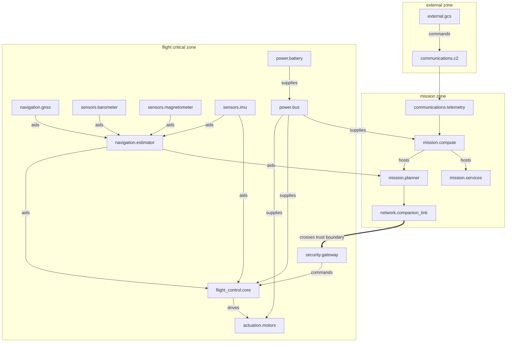
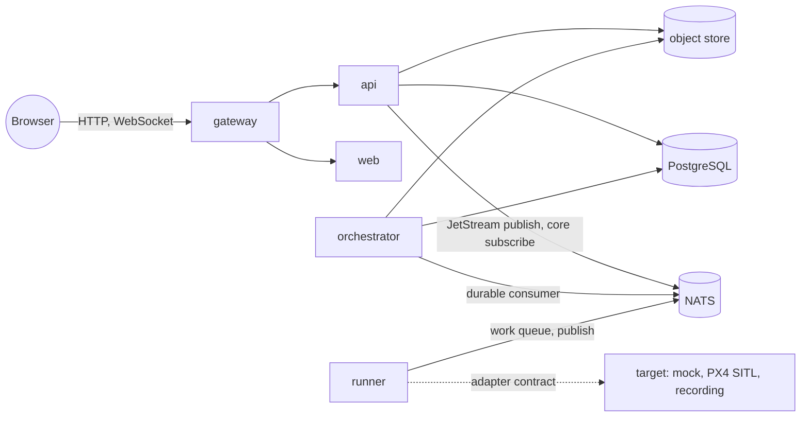

# Trust boundaries

Two different sets of trust boundaries matter in this project, and it helps to keep
them apart:

1. the trust boundaries **inside the system under test**, part of the topology model,
   which the platform uses to decide whether a fault stayed contained;
2. the trust boundaries **of the platform itself**, between browser, gateway, services,
   bus, runners, targets and storage, which the [security model](security-model.md)
   and [threat model](threat-model.md) defend.

This document covers the first and gives a map of the second.

## Trust boundaries in the system under test

The default topology (`packages/core/reslab_core/topology.py`,
`multirotor-companion-v1`) places every component in one of three trust zones, ordered
from least to most trusted:

| Zone | Components |
| ---- | ---------- |
| `external` | `external.gcs`, `communications.c2` |
| `mission` | `communications.telemetry`, `mission.compute`, `mission.planner`, `mission.services`, `network.companion_link` |
| `flight_critical` | `security.gateway`, `navigation.gnss`, `navigation.estimator`, `sensors.barometer`, `sensors.magnetometer`, `sensors.imu`, `flight_control.core`, `actuation.motors`, `power.battery`, `power.bus` |

Two boundaries separate the zones, each with a policy enforcement point:

| Boundary id | Name | From | To | Enforcement point | Description |
| ----------- | ---- | ---- | -- | ----------------- | ----------- |
| `external-mission` | External / Mission boundary | `external` | `mission` | `communications.telemetry` | Ground commands enter the vehicle through the telemetry gateway |
| `mission-flight` | Mission / Flight-critical boundary | `mission` | `flight_critical` | `security.gateway` | Commands from the mission computer are validated by the command gateway before reaching the flight core. The flight core keeps full control authority if everything upstream fails |

The command gateway is described in the topology as a policy enforcement point that
validates mission commands before they reach the flight core and fails closed. In the
mock adapter's behavioral model, a command gateway that is down means the mission
command path is lost (`command gateway unavailable (fail-closed)`) and the declared
`compute_loss` recovery policy applies; the flight core itself keeps flying.

### Dependency graph

Arrows point from provider to dependent: a fault on the provider may propagate to the
dependent. Twenty dependencies exist. Exactly one of them, `network.companion_link` to
`security.gateway`, is marked `crosses_trust_boundary`.

Two things about this graph shape every containment result:

- The flight core depends on the estimator, the IMU, the power bus and the command
  gateway. Only the last of these is fed from the mission zone. A fault in the mission
  zone can therefore reach the flight core only through the command gateway.
- The estimator depends on GNSS, barometer, magnetometer and IMU. Sensor faults degrade
  the estimator; whether they go further depends on the target's behavior. In the mock,
  a degraded estimator never degrades the flight core; only an unhealthy IMU does.

### How the boundaries are used

- **Fault catalog.** Components in the flight-critical zone accept fewer effects
  (`flight_control.core`: `degraded`, `restart`, `resource_pressure`;
  `actuation.motors`: `degraded`, `intermittent`), and injecting into one of the three
  critical components raises the `flight_critical_target` warning.
- **Propagation depth.** The breadth-first search that computes the blast radius follows
  the edges above, only through components observed as affected.
- **Containment.** `containment.critical_domain_reached` (and its alias
  `containment.flight_domain_affected`) is true when any affected component belongs to
  the `flight_control` or `actuation` domain. Every starter scenario asserts
  `containment.flight_domain_affected == false` at severity `critical`.
- **Boundary crossing.** `containment.boundary_crossed` is true when both
  `network.companion_link` and `security.gateway` were affected in the same run: the
  fault travelled along the one edge that crosses the mission/flight boundary.
- **System mode.** A down critical component (`sensors.imu`, `flight_control.core`,
  `actuation.motors`) puts the whole system in mode `FAILED`.
- **Severity.** A critical component going down is always a `critical` event.
- **User interface.** Mission Control draws the mission/flight boundary in the blast
  radius view and the System page lists both boundaries with their enforcement points.

The topology is stored in the `system_topologies` and `system_components` tables and
served by `GET /api/v1/system`, so the UI and the reports use exactly the graph that
the analysis used. The report embeds the topology it was computed against.

### What the boundaries do not claim

The topology is a model of a generic vehicle, not a description of any specific
autopilot. It says where a well-designed system would enforce policy; it does not
verify that a real flight stack does. The PX4 adapter, for example, reports
`security.gateway` and `network.companion_link` as `UNKNOWN` because MAVLink telemetry
gives it no way to observe them. A contained result on a real target is only as strong
as the adapter's ability to observe the flight-critical components.

## Trust boundaries of the platform

| Boundary | What crosses it | Controls |
| -------- | --------------- | -------- |
| Browser to gateway | User input: scenario documents, run requests | Single published port; security headers; body size limit and CORS in the API; every identifier validated |
| Gateway to API and web | Proxied requests | Internal `edge` network; only `/api/*`, `/healthz`, `/readyz` and `/metrics` reach the API |
| API to bus | `RunJob` (validated canonical YAML) | Scenario validated with the strict loader before anything is published; invalid documents never reach a runner |
| Runner to bus | Lifecycle, events, telemetry, artifacts, heartbeats | Typed protocol messages with `protocol_version`; payload cap 8 MiB, artifacts 4 MiB; orchestrator validates every state transition and re-validates artifact names |
| Runner to target | Adapter calls | The runner is on the `control` network only (plus `simulation` for the PX4 runner); it holds no database or object store credentials; adapters receive only whitelisted scalar parameters |
| Orchestrator and API to storage | Rows, artifact objects | Keys built from validated identifiers under `runs/<run_id>/`; `data` network is internal |
| Stored report to browser | HTML artifact | Served with `Content-Security-Policy: default-src 'none'; style-src 'unsafe-inline'; img-src data:` |

The distinguishing choice is that the runner, the component that executes scenarios
and talks to targets, is treated as the least trusted service. Everything it says is
checked by the orchestrator before it becomes state, and it cannot reach the
persistence layer at all. The [security model](security-model.md) details each
control; the [threat model](threat-model.md) lists what could go wrong at each boundary.
